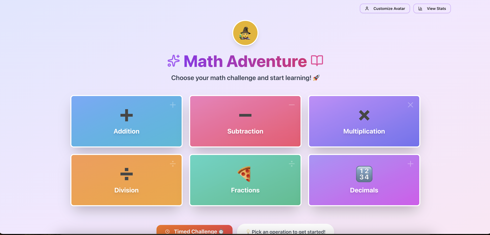
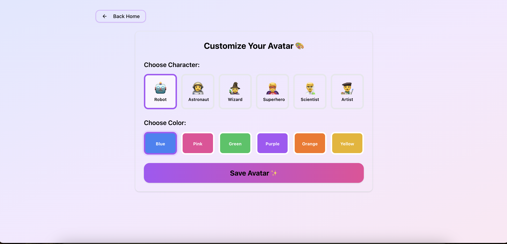
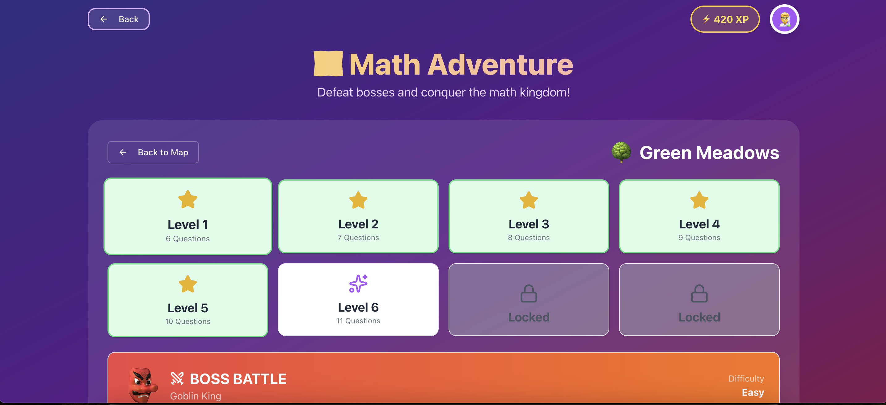

# 🧮 Math Adventure

A web application built with Base44 to help you learn Math through interactive quizes.

[Github Pages Link](https://alfinaim.github.io/Math-Wizards/#/home/)
  

## ✨ Features

* Multiple Math Challenges – Choose from different levels and topics.
* Character Selection – Pick a character to personalize your experience.
* Stats Tracking – View your progress and stats as you play. 
* Interactive Quizzes – Test yourself with engaging math questions.
  

## 🛠️ Tech Stack

* React 
* Local storage
* TailwindCSS
  

## 🚀 Future Plans

* More Math Topics – Add algebra, geometry, fractions, and more advanced challenges.
* Character Progression – Unlock new characters, abilities, or costumes as you improve.
* Hints & Tips – Give players optional hints to help solve difficult problems.
  

## Screenshots

#### Home

#### Avatar

#### Stats

#### Difficulty

#### Game

#### Adventure

#### Level

  

## 💻 Installation

    git clone https://github.com/alfinaim/Math-Wizards.git
    cd Math-Wizards
    npm install
    npm start
